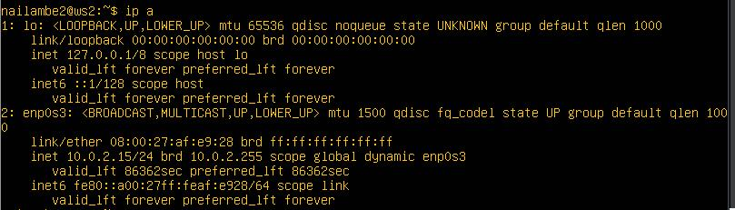
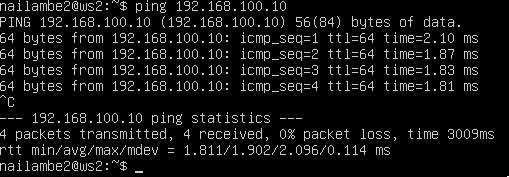
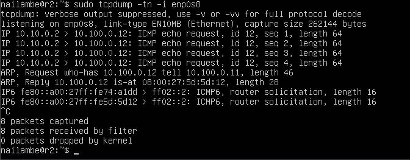
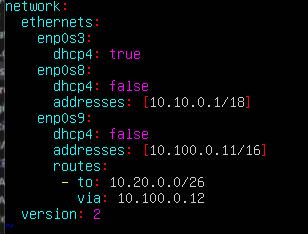
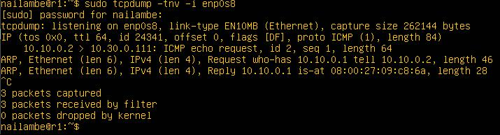
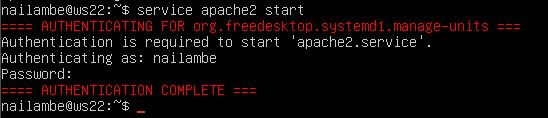

## Part 1. **ipcalc** tool

### 1.1. Networks and Masks

#### 1) Network address of 192.167.38.54/13

- Сеть: 192.160.0.0

#### 2) Конвертация масок

- 255.255.255.0 => /24 => 11111111.11111111.11111111.00000000
- /15 => 255.254.0.0 => 11111111.11111110.00000000.00000000
- 11111111.11111111.11111111.11110000 => 255.255.255.240 => /28

#### 3) Минимальный и максимальный хост в сети 12.167.38.4

- /8 (255.0.0.0):
    - Мин. хост: 12.0.0.1
    - Макс. хост: 12.255.255.254
- 11111111.11111111.00000000.00000000 (255.255.0.0 или /16):
    - Мин. хост: 12.167.0.1
    - Макс. хост: 12.167.255.254
- 255.255.254.0 (/23):
    - Мин. хост: 12.167.38.1
    - Макс. хост: 12.167.39.254
- /4 (240.0.0.0):
    - Мин. хост: 0.0.0.1
    - Макс. хост: 15.255.255.254

### 1.2. localhost

Приложения, запущенные на localhost, могут быть доступны с IP-адресов:

- 127.0.0.2
- 127.1.0.1

Они не могут быть доступны с:

- 194.34.23.100
- 128.0.0.1

### 1.3. Network ranges and segments

#### 1) Публичные и приватные IP-адреса

- Публичные: 134.43.0.2, 172.0.2.1, 172.68.0.2, 192.169.168.1, 192.172.0.1
- Приватные: 10.0.0.45, 172.16.255.255, 10.10.10.10, 172.20.250.4, 192.168.4.2

#### 2) Возможные шлюзы для сети 10.10.0.0/18

Возможные шлюзы:

- 10.10.0.2
- 10.10.10.10
- 10.10.1.255

Невозможные шлюзы:

- 10.0.0.1 (не входит в сеть)
- 10.10.100.1 (не входит в сеть)
## Part 2. Static routing between two machines
- ```ip a```:
  - ws1:  
  
  - ws2:  
  
  
- screenshots of the changed _etc/netplan/00-installer-config.yaml_:  
  - ws1:  
  
  - ws2:  
  

- ```netplan apply```:  
  - ws1:  
  
  - ws2:  
  

### 2.1. Adding a static route manually  
- ```ip r add```:  
  - ws1:  
  
  - ws2:  
  
### 2.2. Adding a static route with saving   
- _etc/netplan/00-installer-config.yaml_:  
  - ws1:  

  - ws2:  
  

- Ping the connection between the machines  
  - ws1:  

  - ws2:  
  

## Part 3. iperf3 utility  
### 3.1. Connection speed

Для перевода единиц измерения скорости:

1.  8 Mbps (мегабит в секунду) в MB/s (мегабайт в секунду):

-   1 байт = 8 бит
-   8 Mbps = 8 * 10^6 бит/с = 8 * 10^6 / 8 байт/с = 1 MB/с

2.  100 MB/s (мегабайт в секунду) в Kbps (килобит в секунду):

-   1 байт = 8 бит
-   100 MB/s = 100 * 8 = 800 Mbps
-   800 Mbps = 800000  Kbps

3.  1 Gbps (гигабит в секунду) в Mbps (мегабит в секунду):

-   1 Gbps = 1 * 10^9 бит/с = 1 * 10^9 / (10^6) = 1000 Mbps  
### 3.2. iperf3 utility  
- Measure connection speed between ws1 and ws2
  - ws1:  
  
  - ws2:  
  
## Part 4. Network firewall  
### 4.1. **iptables** utility  

- _/etc/firewall_ file:
  - ws1:  
  
  - ws2:  
  

- chmod +x /etc/firewall.sh` and `/etc/firewall.sh` commands:  
  - ws1:  
  
  - ws2:  
  


- Правило брандмауэра (межсетевого экрана) определяет критерии для пакета и цели. Если пакет не попадает под действие правила, проверяется следующее правило в цепочке; если попадает - проверяется правило, указанное в цели. Таким образом в ws1 сначала идет правило отменяющее пакет, оно и используется, а в ws2 наоборот.  

**$ iptables -t таблица действие цепочка дополнительные_параметры**

Основные действия, которые позволяет выполнить iptables:

-   **-A** - добавить правило в цепочку;
-   **-С** - проверить все правила;
-   **-D** - удалить правило;
-   **-I** - вставить правило с нужным номером;
-   **-L** - вывести все правила в текущей цепочке;
-   **-S** - вывести все правила;
-   **-F** - очистить все правила;
-   **-N** - создать цепочку;
-   **-X** - удалить цепочку;
-   **-P** - установить действие по умолчанию.

Дополнительные опции для правил:

-   **-p** - указать протокол, один из tcp, udp, udplite, icmp, icmpv6,esp, ah, sctp,  
    mh;
-   **-s** - указать ip адрес устройства-отправителя пакета;
-   **-d** - указать ip адрес получателя;
-   **-i** - входной сетевой интерфейс;
-   **-o** - исходящий сетевой интерфейс;
-   **-j** - выбрать действие, если правило подошло.

### 4.2. **nmap** utility  
- screenshots with the call and output of the **ping** and **nmap** commands:  
  - ws1:  
  
  
  - ws2:  
  
  

## Part 5. Static network routing
### 5.1. Configuration of machine addresses  
- Set up the machine configurations in _etc/netplan/00-installer-config.yaml_ according to the network in the picture:
  - ws11:  
  

   - ws21:  
  

  - ws22:  
  

  - r1:  
  

  - r2:  
  

- `ip -4 a`command:
  - ws11:  
  

   - ws21:  
  

  - ws22:  
  

  - r1:  
  

  - r2:  
  

- ping ws22 from ws21. Similarly ping r1 from ws11.
  - ws11:  
  

   - ws21:  
  
### 5.2. Enabling IP forwarding.  
- `sysctl -w net.ipv4.ip_forward=1`.  
  - r1:  
  
  - r2:  
  

- `net.ipv4.ip_forward = 1` _With this approach, IP forwarding is enabled permanently._  
  - r1:  
  
  - r2:  
  
### 5.3. Default route configuration  
- add `default` before the router's IP in the configuration file
  - ws11:  
  

   - ws21:  
  

  - ws22:  
  

- Call `ip r` and show that a route is added to the routing table
  - ws11:  
  

   - ws21:  
  

  - ws22:  
  

- use the `tcpdump -tn -i eth0
command.
  - r2:   
  
  - ws11:  
  

### 5.4. Adding static routes  
- screenshots of the changed _etc/netplan/00-installer-config.yaml_ file for each router to the report:
  - r1:  
  
  - r2:  
  

- Call `ip r` and show route tables on both routers.
  - r1:  
  
  - r2:  
  

- Run `ip r list 10.10.0.0/[netmask]` and `ip r list 0.0.0.0/0` commands on ws11:
  - ws11:  
  

- У нас уже есть правило для первого адреса, поэтому используется именно этот маршрут, а не стандартный, так как у стандартного маршрута приоритет меньше.
### 5.5. Making a router list  
- call and the output of the used commands (tcpdump and traceroute) to the report: 
  - ws11:  
    
  - r1:  
    
 
- Принцип работы traceroute: Утилита отправляет целевому узлу несколько пакетов с временем жизни 1 (TTL, time to live - число переходов, которые пакет может осуществить до своего исчезновения). Следующий маршрутизатор принимает пакеты и отправляет сообщение, что время жизни пакетов истекло. traceroute фиксирует адрес этого маршрутизатора и отправляет следующие пакеты, уже с TTL 2. Так, каждый раз увеличивая TTL на 1, traceroute составляет список маршрутизаторов, через которе прошли пакеты до целевого узла.
### 5.6. Using **ICMP** protocol in routing
-  Run on r1 network traffic capture going through eth0 with the

   `tcpdump -n -i eth0 icmp` command.

      Ping a non-existent IP (e.g. _10.30.0.111_)     from ws11 with the

     `ping -c 1 10.30.0.111` command.
      - ws11:  
        
      - r1:  
         
  
## Part 6. Dynamic IP configuration using **DHCP**
- Сначала ставим isc-dhcp-server на оба роутера  
- For r2, configure the **DHCP** service in the _/etc/dhcp/dhcpd.conf_ file:
  - r2:  
     
- Write `nameserver 8.8.8.8` in a _resolv.conf_ file:
  - r2:  
    
- Restart the **DHCP** service with `systemctl restart isc-dhcp-server`. Reboot the ws21 machine with `reboot` and show with `ip a` that it has got an address. Also ping ws22 from ws21.
  - r2 restart service:   
     
  - ws21 `ip a` command:  
     
  - ws21 pings ws22:   
    
- Specify MAC address at ws11 by adding to _etc/netplan/00-installer-config.yaml_:  
  - ws11:  
  

- Сonfigure r1 the same way as r2, but make the assignment of addresses strictly linked to the MAC-address (ws11). Run the same tests  
  - r1 dhcp config:  
    
  - r1 resolve config:  
    
   - r1 restart service:  
      
- Request ip address update from ws21:  
  - ws11 before ip update:  
    
   - ws11 after ip update:  
          
- Сначала мы использовали комманду `dhclient -r enp0s8` чтобы очистить все адреса в этом интерфейсе, затем мы используем `dhclient enp0s8` чтобы назначить новый динамический адрес.

## Part 7. **NAT** 
- Нужно установить на обе машины apache2
- In _/etc/apache2/ports.conf_ file change the line `Listen 80` to `Listen 0.0.0.0:80`on ws22 and r1, i.e. make the Apache2 server public
  - ws22  
          
  - r1  
          
- Start the Apache web server with `service apache2 start` command on ws22 and r1  
  - ws22  
          
  - r1  
            
- Add the following rules to the firewall, created similarly to the firewall from Part 4, on r2:

  1) delete rules in the filter table - `iptables -F`

  2) delete rules in the "NAT" table - `iptables -F -t nat`

  3) drop all routed packets - `iptables --policy FORWARD DROP`
  
 - [](#run-the-file-as-in-part-4)Run the file as in Part 4  
   - r2   
       
  
- Check the connection between ws22 and r1 with the `ping` command

  _When running the file with these rules, ws22 should not ping from r1_   
   - r1  
      
    4) allow routing of all **ICMP** protocol packets  
    
     - r2   
     
 - Check connection between ws22 and r1 with the `ping` command

   _When running the file with these rules, ws22 should ping from r1_  
    - r1  
      
- Add two more rules to the file:

  5) enable **SNAT**, which is masquerade all local ip from the local network behind r2 (as defined in Part 5 - network 10.20.0.0)

  _Tip: it is worth thinking about routing internal packets as well as external packets with an established connection_

  6) enable **DNAT** on port 8080 of r2 machine and add external network access to the Apache web server running on ws22

  *Tip: be aware that when you will try to connect, there will be a new tcp connection for ws22 and port 80
   - r2   
     
- Check the TCP connection for **SNAT** by connecting from ws22 to the Apache server on r1 with the `telnet [address] [port]` command
  - ws22  
       
- Check the TCP connection for **DNAT** by connecting from r1 to the Apache server on ws22 with the `telnet` command (address r2 and port 8080)  
   - r1  
       
## Part 8. Bonus. Introduction to **SSH Tunnels**  

  - Нужно установить openssh-server на машины  
  - Run a firewall on r2 with the rules from Part 7:
     - r2   
     
  - Start the **Apapche** web server on ws22 on localhost only (i.e. in _/etc/apache2/ports.conf_ file change the line `Listen 80` to `Listen localhost:80`)
    - ws22 apache config `sudo vim /etc/apache2/ports.conf`:  
      
     - ws22 apache start `service apache2 start`:  
      
 - Use _Local TCP forwarding_ from ws21 to ws22 to access the web server on ws22 from ws21
   - ws21 ssh connect `ssh -L 8080:10.20.0.20:80 localhost`:  
        
- Use _Remote TCP forwarding_ from ws11 to ws22 to access the web server on ws22 from ws11  
    - ws11 ssh connect `ssh -L 8080:10.20.0.20:80 localhost`:  
        
 - To check if the connection worked in both of the previous steps, go to a second terminal (e.g. with the Alt + F2) and run the `telnet 127.0.0.1 [local port]` command.  
     - ws21 telnet check `telnet 127.0.0.1 8080`:  
        
      - ws11 telnet check `telnet 127.0.0.1 8080`:  
        